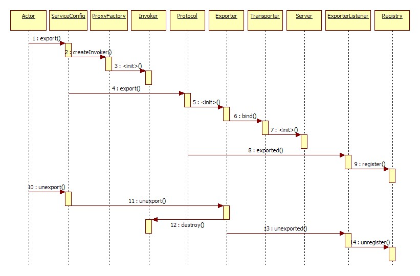

"dubbo demo" 

#### 服务暴露过程

#### 服务引用过程

#### 整体架构

#### 调用流程地图

#### 解决多版本同时组成到zk上失败的问题
`DubboConfigDefaultPropertyValueBeanPostProcessor` 重新设置id生成规则
#### `AbstractConfig#addIntoConfigManager`
> 在Bean初始化完成后会将自身注册到ConfigManager中, 所有继承AbstractConfig均会执行该逻辑

